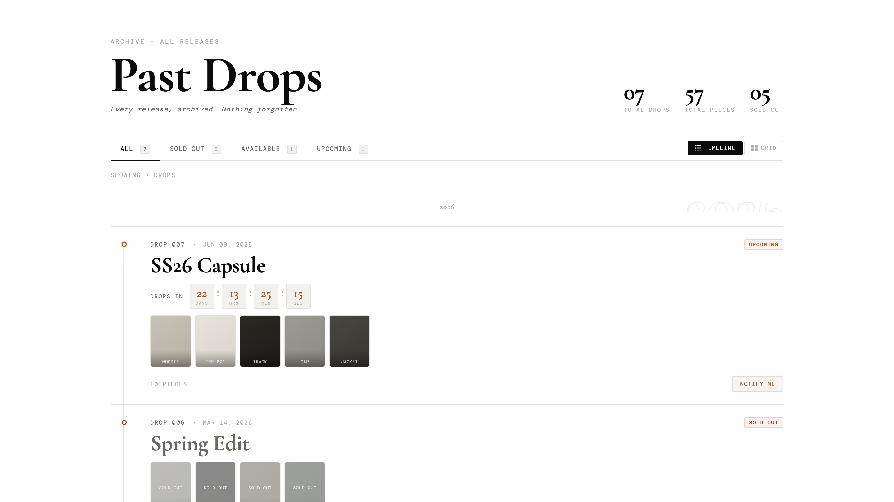

# Past Drops Archive — Shopify Section

**Part of [shopifycraft.dev](https://shopifycraft.dev) free sections library**

Display your full drop history in a filterable timeline or grid. Status badges, live countdowns, product thumbnails from collections — one file, no app.

**Replaces drop archive apps charging $19–$49/month.**

---

## Preview



---

## Installation

### Option A — Shopify Admin (no CLI)

1. **Online Store → Themes → ⋯ → Edit code**
2. Open the `sections/` folder → **Add a new section**
3. Name it `past-drops-archive`
4. Delete the placeholder content
5. Paste the full contents of `past-drops-archive.liquid`
6. Click **Save**
7. Go to **Theme Editor → Add section → Past Drops**

### Option B — Shopify CLI

```bash
shopify theme pull --store your-store.myshopify.com
cp past-drops-archive.liquid your-theme/sections/
shopify theme push --store your-store.myshopify.com
```

---

## Setup

1. Open **Theme Editor** → navigate to any page
2. Click **Add section → Past Drops**
3. Click **Add block → Drop** for each release and fill in the fields below

---

## Drop Block Fields

| Field | Example | Notes |
|-------|---------|-------|
| Drop number | `DROP 001` | Label shown above the drop name |
| Drop name | `Origin` | Main heading of the card |
| Release date | `2025-04-15` | Format: `YYYY-MM-DD` — required for countdown & year grouping |
| Status | `Sold Out` | Sold Out / Available / Upcoming |
| Collection | — | Products auto-load as thumbnails, piece count is automatic |
| CTA URL override | `/collections/drop-001` | Leave blank to use the collection URL |
| Notify Me URL | `/pages/notify` | Upcoming drops only — links to a sign-up form |

---

## Section Settings

| Setting | Description |
|---------|-------------|
| Label | Small eyebrow text above the heading |
| Heading | Main section title — default: "Past Drops" |
| Subheading | Italic subtitle below the heading |
| Show stats row | Toggle the drops / pieces / sold-out counters |
| Show filter bar | Toggle the All / Sold / Available / Upcoming filters |
| Show layout toggle | Toggle the Timeline / Grid switcher |
| Default layout | Timeline or Grid |
| Heading font | Font for title, drop names, countdown numbers |
| Label font | Font for badges, metadata, buttons |
| Footer note | Small text at the bottom of the section |
| Color scheme | Inherits from theme color schemes |
| Padding top / bottom | Section vertical spacing |

---

## Compatibility

| Theme | Compatible |
|-------|-----------|
| Dawn | ✅ |
| Horizon | ✅ |
| Sense | ✅ |
| Impulse | ✅ |
| Prestige | ✅ |
| Custom OS 2.0 themes | ✅ |

---

## File

```
past-drops-archive.liquid   ← one file, everything included
```

No separate CSS. No separate JS. No dependencies.

---

## Hire Us

Need this customized — different layout, metafield integration, multi-language, or a full bespoke section?

**→ [shopifycraft.dev/hire](https://shopifycraft.dev/hire)**
**→ [hello@shopifycraft.dev](mailto:hello@shopifycraft.dev)**

We respond within 24 hours.

---

## License

MIT — free to use and modify. Attribution appreciated but not required.

*Built by [shopifycraft.dev](https://shopifycraft.dev)*
